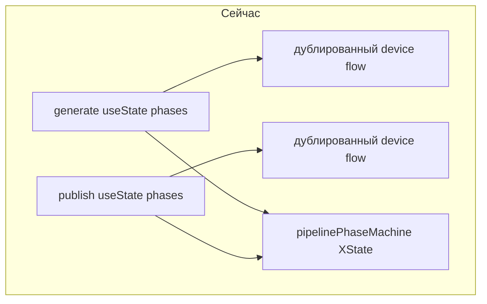
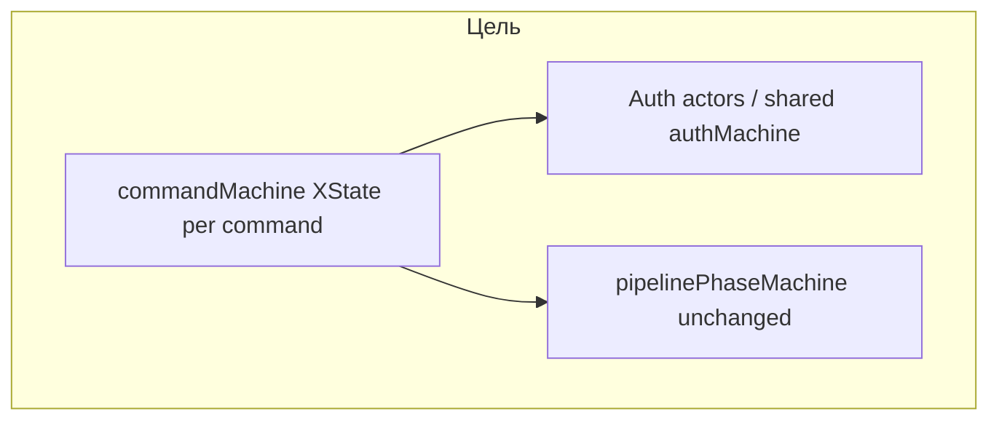

# Рефакторинг команд CLI: auth, состояние, читаемость

**Цель рефакторинга:** не только DRY для auth, а **понятная модель состояния команд** — без десятков `useState`/`setPhase` и `useEffect`, завязанных на строку фазы. Итог: тот же стек, что уже есть для пайплайна (**XState**), плюс общий auth- слой в core.

## Диагноз (что не так сейчас)

**Разрозненный UI-state.** В `generate` / `publish` / `unpublish` много полей (`phase`, `error`, `jwt`, `userCode`, `verificationUri`, результаты пайплайна, …) и ручных `setPhase` / `setX`. Переходы размазаны по `useEffect`, колбэкам и обработчикам ввода. Это сложно читать и тестировать; легко получить несогласованное состояние (например фаза уже `done`, а `error` не сброшен).

**Дублирование auth.** В [`src/commands/generate.tsx`](src/commands/generate.tsx) и [`src/commands/publish.tsx`](src/commands/publish.tsx) почти одинаковый сценарий: `readAuthToken` → при отсутствии JWT — `startDeviceFlow` → `open` URL → цикл `pollForToken` с `PendingError` / `SlowDownError`. Логика примитивов уже в [`packages/core/src/auth.ts`](packages/core/src/auth.ts), но «сценарий до готового JWT» собран дважды в UI-слое.

**Два уровня «фаз», легко перепутать.** Внутри [`src/components/Pipeline.tsx`](src/components/Pipeline.tsx) уже используется XState ([`src/pipeline/phase-machine.ts`](src/pipeline/phase-machine.ts)): `init` → `scanning` → … → `done`. Команды же держат **свой** длинный union фаз (`checking-auth`, `auth`, `pipeline`, `publish-offer`, …) на `useState` + несколько `useEffect`, завязанных на `phase`. Это не противоречие дизайна, но без явного разделения в коде и в документации выглядит как «машина есть, но везде переходы».

**Имя `setPhase` там, где уже машина (два разных случая).**

1. **[`Pipeline.tsx`](src/components/Pipeline.tsx)** — единственный источник правды по фазам пайплайна это **XState** (`useMachine(pipelinePhaseMachine)`). Локальный `setPhase` — не второй React-state, а **обёртка** над `send(gotoPhaseEvent(next))` с проверкой [`isValidPhaseTransition`](src/pipeline/phase-machine.ts). То есть «стейт машина есть», а `setPhase` читается как `useState` и вводит в заблуждение. Плюс десятки императивных вызовов `setPhase("analyzing")` по файлу; в [`phase-machine.ts`](src/pipeline/phase-machine.ts) комментарий *«Keep in sync with setPhase / flow in Pipeline.tsx»* — признак того, что граф и императивный поток всё ещё нужно держать согласованными вручную.
2. **Команды** (`generate`, `publish`, …) — здесь `phase` / `setPhase` это **настоящий** `useState`, параллельно дочерний `<Pipeline>` живёт на XState. Отсюда главный когнитивный разрыв: «внутри одной команды два стиля».

**Цель по `setPhase`:** в командах — убрать полностью (command machine + `send`). В `Pipeline` — по желанию follow-up: переименовать обёртку в `transitionToPhase` / `gotoPhase` и/или по мере рефактора смещаться на **именованные события** в определении машины, чтобы не разъезжались таблица рёбер и императивные вызовы; либо оставить обёртку, но **задокументировать** в заголовке `Pipeline`, что это thin adapter к XState, не React state.

**Мелкий техдолг.** В `generate` в типе фазы есть `auth-polling`, но переход в неё нигде не делается (мёртвый вариант). В `publish.tsx` около строки 153 остался `console.log("DEBUG: result.url =", …)` — шум в проде.

**Разные политики ок.** `generate` при ошибке auth **продолжает без JWT** (комментарий в коде). `publish` и `unpublish` требуют JWT. Это нормально, но должно быть **одним явным параметром** общего хелпера, а не копипастой веток.





---

## Целевая модель (после рефактора)

**Слой 1 — core (без Ink).** Один сценарий «получить JWT»: либо из файла, либо device flow до успеха/ошибки. Например в [`packages/core/src/auth.ts`](packages/core/src/auth.ts) (или рядом `auth-device-flow.ts`):

- `runDeviceFlowPoll(deviceCode, initialInterval)` — единственный цикл ожидания с обработкой `PendingError` / `SlowDownError` (сейчас продублирован в двух командах).
- `ensureAuth(options: { required: boolean })` → результат: `{ kind: "jwt"; token: AuthToken } | { kind: "skipped" } | { kind: "error"; error: Error }` — чтобы `generate` вызывал `required: false`, `publish` — `required: true`.

**Слой 2 — UI-обёртка для Ink.** Новый модуль, например [`src/components/AuthGate.tsx`](src/components/AuthGate.tsx) или [`src/auth/useAuthSession.ts`](src/auth/useAuthSession.ts):

- Состояния для рендера: минимум `checking` | `device_prompt` (uri + userCode) | `polling` | `ready` | `failed` — без размазывания по 10 строковым именам в каждой команде.
- Один компонент разметки для «Enter code / Waiting…» (сейчас разметка в `generate` и `publish` слегка расходится по текстам).

**Слой 3 — оркестрация команды через XState (обязательно в этом рефакторе).** Не накапливать `setState` в компонентах команд.

- Отдельные машины (файлы рядом: например `src/pipeline/generate-flow.machine.ts`, `publish-flow.machine.ts`, `unpublish-flow.machine.ts`) **или** одна фабрика `createCommandFlow(context)` с разным контекстом — решение при реализации; важно: **граф состояний и переходы в одном месте**, `send({ type: ... })` вместо десятка `setPhase`.
- Контекст машины держит: флаги опций CLI, ссылки на результаты (`PipelineResult`, markdown, url), ошибки, JWT при необходимости. Side effects (вызов `publishToApi`, `exit`, `open`) — в `actions` / `invoke` / `fromPromise`, а не размазанные по `useEffect`.
- Вложенность: **command machine** монтирует дочерний контур только когда нужно — например рендер `<Pipeline>` в состоянии `runningPipeline`; внутри `Pipeline` по-прежнему [`pipelinePhaseMachine`](src/pipeline/phase-machine.ts) без смешивания графов (два уровня XState, разные `id` и ответственность).
- **Login:** минимальный граф `idle → authenticating → done | error` или повторное использование общей `authMachine` без лишних состояний.

**Почему не только `useReducer`:** reducer на одном файле тоже убирает разрозненный `setState`, но граф переходов и инварианты для сложных веток (generate/publish) читаются хуже, чем в XState; в проекте уже есть зависимость и паттерн тестов для машин. Если какая-то команда останется линейной после выноса auth — допустим компактный `useReducer` как исключение, не дефолт.

**MobX** по-прежнему не используем (см. ниже).

### Команда `login` (обязательно по продукту)

- Новая команда, например `agent-cv login`: только GitHub device flow → сохранение JWT (и побочных creds, как сейчас в `pollForToken`), **без** запуска пайплайна и без вызова publish API.
- Назначение: восстановить локальную сессию после удаления `auth.json`, CI, смены машины — без вводящего в заблуждение текста «сначала publish».
- Реализация: тот же общий хук/компонент, что и для остальных команд; тело команды минимальное (вызвать `ensureAuth({ required: true })` + UI + exit success).

**Зафиксировано (design, 2026-04-09):** после успеха одна строка **`Logged in.`** (англ., с точкой). Во время poll — **текст + Ink `Spinner`**. Прерывание ожидания: **`q`** (через `useInput`) и **Ctrl+C** (SIGINT); в README/CONTRIBUTING кратко описать оба способа.

### `unpublish` + device flow при отсутствии JWT (обязательно по продукту)

- Если локального JWT нет: не показывать ошибку «run publish first»; вместо этого запустить **тот же** device flow через общий слой, после успешного логина выполнить `DELETE` с тем же JWT.
- После рефактора дублирования UI нет: `unpublish` использует `AuthGate` / `useAuthSession`, как `publish`, а не копипасту из `publish.tsx`.
- Опционально позже: флаг `--yes` для пропуска интерактивного подтверждения удаления (если добавите confirm), в том же PR или follow-up.

---

## Полный рефакторинг: этапы работ

1. **Core** — `runDeviceFlowPoll`, `ensureAuth({ required })`, единый API base URL для HTTP к agent-cv (чтобы `unpublish` и `auth` не расходились).
2. **Ink** — общий компонент/хук отображения device flow (и при необходимости подписка на события машины).
3. **XState-машины команд** — спроектировать графы для `generate`, `publish`, `unpublish`, `login`; перенести логику из `useEffect` в `invoke`/`transition`; компоненты команд становятся тонкими: `useMachine` + разметка по `state.value` / контексту.
4. **Интеграция с `Pipeline`** — из состояния «запущен пайплайн» рендерить существующий `<Pipeline onComplete={...} />`; по `onComplete` слать событие в родительскую command machine (не через новый `setPhase` в родителе).
5. **Polish** — убрать DEBUG в publish; `exit()` в unpublish; переименовать вводящие в заблуждение имена фаз; опционально confirm / `--yes` для unpublish; help / README при `login`.
6. **Документация** — три уровня: core auth → command XState → pipeline XState.

Порядок разумный: **сначала core + общий auth UI**, затем **по одной команде** (например `unpublish` как самая маленькая машина, потом `publish`, потом `generate`), чтобы не разорвать всё в одном коммите.

---

## Что не трогаем в этом рефакторе (явный scope)

- Внутренняя логика [`Pipeline.tsx`](src/components/Pipeline.tsx) и граф [`phase-machine.ts`](src/pipeline/phase-machine.ts) — только если всплывёт общая потребность (например общий тип «фаза» для логов).
- [`config.tsx`](src/commands/config.tsx), [`diff.tsx`](src/commands/diff.tsx), [`stats.tsx`](src/commands/stats.tsx) — без auth device flow; трогать только при появлении общих паттернов (не обязательно в первом PR).

**В scope этого рефактора:** [`unpublish.tsx`](src/commands/unpublish.tsx) — перевод на общий auth UI + device flow при отсутствии JWT; новая команда `login` (см. выше).

### Решение: MobX не рассматриваем

- **Не добавляем MobX** в этом рефакторе и не делаем его условием «улучшения» CLI.
- Причины: уже есть React state в командах и **XState** для пайплайна; третья парадигма (observable stores) ухудшит onboarding без решения дублирования auth.
- Если позже понадобится больше общего состояния между командами — сначала **shared auth + при необходимости `useReducer` или вторая XState-машина** для оболочки команды, в том же стиле что [`phase-machine.ts`](src/pipeline/phase-machine.ts). Пересмотр MobX — только при росте продукта и явной боли, не заранее.

---

## Тесты

- Юнит-тесты на **`runDeviceFlowPoll`** / `ensureAuth` с моками `fetch` и контролируемой последовательностью `PendingError` → success (файл рядом с существующими тестами core, например [`test/`](test/)).
- **Тесты command machines** — переходы и запрет невалидных переходов на чистых событиях, по аналогии с [`test/phase-machine.test.ts`](test/phase-machine.test.ts); минимум happy path + auth failure + отмена где есть confirm.
- **Расширение по `/plan-eng-review` (2026-04-09):**
  - `ensureAuth({ required: true })` — отдельный тест на ветку «нет файла → device flow → success» и на «ошибка до сохранения токена».
  - `ensureAuth({ required: false })` — ветка `skipped` при отказе/ошибке не должна ломать последующий сценарий generate (контракт результата).
  - Publish-flow: тест «нельзя перейти в publishing без JWT» (событие отклонено или остаётся в error).
  - Command machine ↔ Pipeline: мок `onComplete` и мок `onError` — родительская машина уходит в `done` / `failed` (регресс «забыли пробросить onError»).
  - `login`: интеграционный тест с моками core + проверка вызова `exit(0)` в успехе (паттерн как [`test/pipeline-ui-runner.test.ts`](test/pipeline-ui-runner.test.ts) / ink harness).
  - Unpublish: DELETE вызывается с тем же base URL, что и publish (мок `fetch` / один helper — один тест на URL).
  - **Design-locked UI (pass 2):** poll state рендерит **Spinner** + status text; тест на **нажатие `q`**; отдельный сценарий на **SIGINT** (где применимо в harness).
  - После реализации — прогон `bun test` в CI (убедиться что [`test.yml`](.github/workflows/test.yml) или аналог не сломан).

---

## Критерий успеха

- Один импортируемый сценарий device flow в core; команды не содержат копипасты цикла polling.
- **Оркестрация команд** — через XState (или явно согласованный исключение с `useReducer`), не через длинный список `useState` в каждом файле команды.
- Читатель видит **три уровня**: core auth → command machine → pipeline machine.
- Меньше строк в `generate`/`publish` на верхнем уровне, нет отладочного `console.log` в publish.
- Есть `agent-cv login` для восстановления сессии без публикации.
- `unpublish` при отсутствии локального JWT предлагает sign-in в том же запуске (device flow), затем удаление; сообщения не отсылают к «publish» как к единственному способу логина.

---

## CEO REVIEW REPORT

**Review date:** 2026-04-09 | **Branch:** master (plan-only; implementation not started) | **Mode applied:** HOLD SCOPE (scope already expanded in prior iterations; this pass stress-tests execution, does not add product scope)

### 0A. Premise challenge

- **Right problem?** Yes. Duplicated auth + two parallel mental models (`useState` phases vs `pipelinePhaseMachine`) creates real bugs and onboarding cost. Fixing the *developer* experience here directly improves reliability of what users run in the terminal.
- **User outcome?** Clearer auth recovery (`login`), correct `unpublish` without bogus "publish first", fewer impossible UI states. The plan ties technical work to those outcomes.
- **If we did nothing?** Pain is real: every new command would copy-paste device flow again; `setPhase` drift continues.

### 0C-bis. Implementation alternatives

| Approach | Summary | Effort | Risk |
|----------|---------|--------|------|
| **A — Core + Ink only** | Extract `ensureAuth` / shared Auth UI; leave commands on `useState` | S | Low short-term; **medium long-term** (half the cognitive debt remains) |
| **B — As written** | Core + Ink + **command-level XState** for generate/publish/unpublish/login | L | Medium (two nested machines to integrate cleanly); **best alignment** with existing `phase-machine` pattern |
| **C — Monolithic command machine** | One machine with mode in context for all commands | M–L | Higher coupling; harder to test in isolation |

**Recommendation:** **B** — matches "engineered enough" preference; phased rollout (unpublish → publish → generate) already in the plan reduces blast radius.

### 0D. HOLD SCOPE checks

- **Complexity:** Touches core, multiple commands, new machines. Mitigated by explicit sequencing and "do not rewrite Pipeline internals" boundary. **Watch:** avoid a single mega-PR; merge core+auth UI first if possible.
- **Contradiction to resolve in implementation:** Section "Что не трогаем" says Pipeline internals unchanged, while `pipeline-setphase-followup` suggests follow-up refactors. **Clarify:** first PR = docs + rename wrapper only if trivial; deeper Pipeline refactors stay a separate ticket.

### Section 1 — Architecture (condensed)

```
core (ensureAuth, API base URL)
    ↑
Ink (AuthGate / device UI)
    ↑
command machines (XState) — generate | publish | unpublish | login
    ↓ onComplete event
Pipeline component → pipelinePhaseMachine (unchanged graph)
```

- **Coupling risk:** Parent command machine must subscribe to `Pipeline` completion via **events**, not parent `setState`. Plan states this; make it a merge gate in code review.
- **Invalid transitions:** Command machines should forbid e.g. `publishing` without JWT where required — encode in graph, not only in UI checks.

### Section 2 — Error and rescue (gaps to close in implementation)

| Path | Failure | Plan coverage | Action |
|------|---------|---------------|--------|
| `runDeviceFlowPoll` | Network drop, 401, malformed JSON | Tests mentioned | Ensure **user-visible** string per case; no silent retry loop without feedback |
| `ensureAuth({ required: false })` + user continues | Publish path accidentally without JWT | Policy in plan | **Assert** in publish machine: cannot enter publish API states without token |
| Nested machine | Child throws before `onComplete` | Not explicit | Command machine needs `onError` from `Pipeline` wired to `failed` state |

### Section 3 — Security (brief)

- No new trust boundary if consolidating existing device flow and file-stored JWT. **Verify:** `AGENT_CV_API_URL` cannot be tricked into attacker host via env in CI (document trusted config for enterprise users).
- `unpublish` DELETE: ensure URL construction uses same validated base URL helper as publish.

### Section 6 — Tests

- Plan covers unit tests for core + machine transitions. **Add explicit:** one **integration-style** test that mounts the thin command component with mocked core (or harness like existing pipeline UI tests) for `login` happy path — the test that would catch "forgot to call `exit()`".

### Section 10 — Trajectory

- **Reversibility:** High (4/5). Mostly additive files + refactors; rollback is revert PR.
- **Debt:** If command machines proliferate copy-paste, extract shared **auth subgraph** or `fromMachine` utilities in a follow-up.

### NOT in scope (reaffirmed)

- MobX (correctly excluded).
- Agent adapter version pinning (`TODOS.md`) — unrelated.
- Full Pipeline imperative-to-event migration — explicitly follow-up (`pipeline-setphase-followup`).

### Optional expansions (defer unless free bandwidth)

- Structured **CLI telemetry** event on auth success/failure (helps production debug); not required for this refactor.
- **`--json` / machine state dump** for CI — nice for agents; separate ticket.

### Implementation decisions (locked 2026-04-09)

**Set via `/plan-eng-review` AskQuestion:**

1. **Machine files vs factory:** **Separate `*.machine.ts` per command** (generate, publish, unpublish, login). Matches `phase-machine.ts` pattern and keeps reviewable diffs.
2. **Shared auth subgraph timing:** **Extract shared auth machine/states in the same PR as the first command migration** (user chose aggressive extraction; ensure `ensureAuth` + Ink AuthGate land first in the same PR sequence so the subgraph matches real UI).

### Verdict

**STRONG.** The plan names the real disease (split state models + duplicated auth), sequences work to limit risk, and ties success criteria to user-visible behavior. Main execution risks are nested XState wiring and error propagation across the Pipeline boundary — call those out in PR review and tests.

**STATUS:** DONE (CEO review of plan document; no code changes)

---

## ENG REVIEW REPORT

**Review date:** 2026-04-09 | **Commit:** `813fa8c` | **Mode:** FULL_REVIEW (plan document) | **Test runner:** `bun test` ([`package.json`](package.json))

### Step 0: Scope challenge

1. **Existing leverage:** [`packages/core/src/auth.ts`](packages/core/src/auth.ts), [`src/pipeline/phase-machine.ts`](src/pipeline/phase-machine.ts), [`src/components/Pipeline.tsx`](src/components/Pipeline.tsx) — план переиспользует, не дублирует граф пайплайна. Хорошо.
2. **Minimum vs plan:** «Только core + Ink» сократил бы файлы, но оставил бы split state в командах. Текущий объём оправдан целью «убрать setState в командах»; риск — много файлов. Митигация: поэтапные PR уже в плане.
3. **Complexity check:** Триггер (>8 файлов) срабатывает. План не раздувает scope новыми фичами; внутренняя дисциплина PR — обязательна.
4. **Search / patterns:** XState уже в зависимостях — не тратим innovation token на новый state lib. **[Layer 1]**.
5. **TODOS.md:** Пункты про адаптеры агентов / inventory migration **не блокируют** этот рефактор; в один PR с CLI не смешивать.
6. **Completeness:** Раздел «Тесты» расширен ниже по результатам coverage pass (было общо — стало с явными ветками).
7. **Distribution:** Артефакт npm/binary уже описан в repo; после изменений — убедиться, что CI запускает `bun test`.

### Section 1 — Architecture

**Dependency graph (target):**

```
packages/core (auth, publish HTTP helpers, API base URL)
       ↑
src/components AuthGate + command *.machine.ts (XState)
       ↑
src/commands/*.tsx (thin: useMachine + Ink)
       ↓
Pipeline.tsx → pipelinePhaseMachine
```

- **[P2] (confidence: 8/10)** Две вложенные машины: зафиксировать контракт **событий** между родителем и `Pipeline` (`PIPELINE_DONE` / `PIPELINE_ERROR` в типах), иначе рефактор через 3 месяца сломается при добавлении фазы в пайплайн.
- **[P3] (confidence: 7/10)** `systemId` / уникальные id акторов в логах телеметрии (если есть) — иначе отладка «какая машина» в логах смешается.

**Production failure scenario:** GitHub device endpoint недоступен — план подразумевает ошибку в `ensureAuth`; убедиться, что Ink показывает сообщение, а не пустой экран (тест в разделе Тесты).

### Section 2 — Code quality (plan-level)

- Новые `*.machine.ts` — держать **короткими**: общую логику auth вынести в `authMachine` или shared states, иначе DRY нарушится между generate/publish.
- После рефактора обновить ASCII/комментарии в [`phase-machine.ts`](src/pipeline/phase-machine.ts) если меняется смысл «sync with Pipeline» (diagram maintenance из предпочтений).

### Section 3 — Test coverage map (plan trace)

```
CODE PATH COVERAGE (planned)
============================
[+] packages/core ensureAuth / runDeviceFlowPoll
    ├── [GAP→add] required:true happy path
    ├── [GAP→add] PendingError chain → success
    ├── [GAP→add] network throw → error kind
    └── [GAP→add] required:false → skipped | jwt

[+] publish-flow.machine (or equivalent)
    ├── [GAP→add] invalid: publishing without JWT — transition rejected or error
    └── [GAP→add] cancel confirm path if present

[+] integration parent machine + Pipeline callbacks
    ├── [GAP→add] onComplete → parent transition
    └── [GAP→add] onError → parent failed (CRITICAL for silent bugs)

[+] login command
    └── [GAP→add] [→E2E or ink harness] success exits 0

COVERAGE note: план до ревью покрывал happy path словами; конкретные GAP закрыты списком в «Тесты» выше.
```

### Section 4 — Performance

- Poll loop уже с backoff в духе SlowDown — не добавлять busy-wait. При выносе в core сохранить интервалы как сейчас.
- Нет БД — N+1 не применимо.

### Failure modes registry (plan)

| Codepath | Failure | Test? | User sees? |
|----------|---------|-------|------------|
| ensureAuth | fetch throws | add | error message |
| Pipeline | analysis failure | existing + wire onError to parent | error state |
| unpublish DELETE | 404 / 401 | add | clear message |

**CRITICAL gap (implementation):** если `onError` не подключён к command machine — пользователь видит «зависание» или старую фазу. Закрыть тестом из таблицы выше.

### NOT in scope (eng)

- Миграция графа `Pipeline` на чистые события без `setPhase` — отдельный тикет (`pipeline-setphase-followup`).
- Менять релизный pipeline npm — только если сломается `bun test` в CI.

### What already exists

- `test/phase-machine.test.ts`, pipeline UI harness — опереться на те же паттерны для command machines.

### Parallelization

| Lane | Work | Depends on |
|------|------|------------|
| A | Core `ensureAuth` + poll | — |
| B | Ink AuthGate (может идти параллельно после контрактов типов из A) | A (типы результата) |
| C | unpublish machine | A, B |
| D | publish machine | A, B, C optional |
| E | generate machine | A, B, D optional |

**Lanes A→B** частично параллельны в отдельных ветках; **C/D/E** последовательны по продукту. Конфликт: одни и те же `src/commands/*.tsx` — лучше **одна ветка последовательно**, как в плане.

### Completion summary (eng)

- Step 0: scope accepted as-is; complexity flagged, mitigated by phased PRs.
- Architecture: 2 findings (P2/P3).
- Code quality: 1 cluster (DRY machines).
- Tests: diagram + gaps added to plan body.
- Performance: no issues.
- critical_gaps: 0 at plan level; 1 **implementation-critical** (onError wiring) flagged for coding phase.
- unresolved (strategic): superseded by pass 2 (locked).

**STATUS:** DONE (plan-eng-review on plan document)

### Pass 2 — 2026-04-09 (re-validation + decisions)

- **HEAD:** `813fa8c` (unchanged; implementation not started).
- **Prior learning applied:** `silent-catch-swallow-pattern` (confidence 10/10) — auth refactor must not add empty `catch` around device flow without a user-visible outcome; align with [`src/commands/publish.tsx`](src/commands/publish.tsx) patterns called out in learnings.
- **Code sanity check:** `DEBUG: result.url` still present in [`publish.tsx`](src/commands/publish.tsx) (~153); second `console.log` for manual open is user-facing, keep or downgrade to stderr per polish step.
- **Design locks folded into engineering:** Tests must cover **Ink `Spinner`** during poll, **`q`** via `useInput`, and **SIGINT** (separate cases). Add to harness where `ink-testing-library` can simulate keypress.
- **Structural decisions (locked):** See CEO **Unresolved decisions** section above — separate machine files + shared auth subgraph in first migration PR.

**Completion summary (pass 2):**

- Step 0: scope unchanged; still phased PRs.
- Architecture: prior P2/P3 stand; **no new issues** from file read.
- Code quality: same DRY cluster for machines.
- Tests: test plan artifact written to `~/.gstack/projects/agent-cv-agent-cv/devall-master-eng-review-test-plan-20260409-plan-eng-review.md`.
- Performance: unchanged.
- unresolved (strategic): **0** (user locked factory vs files and auth subgraph timing).
- Outside voice: not re-run (plan-stage; optional on implementation PR).

**STATUS:** DONE (pass 2)

---

## DESIGN REVIEW REPORT (plan-design-review)

**Classifier:** APP UI (terminal / Ink), not marketing web. Apply calm hierarchy, utility copy, minimal chrome; no hero/carousel rules.

**DESIGN.md:** Not present. Calibrate against existing Ink usage in [`src/commands/publish.tsx`](src/commands/publish.tsx), [`src/commands/unpublish.tsx`](src/commands/unpublish.tsx): `Text` with `color="gray"` for status, `green` / `red` for outcome.

### Step 0 — design completeness

- **Initial score:** 6/10 (architecture and AuthGate states listed; missing explicit copy order, state table, narrow-terminal behavior).
- **Target 10/10 for this plan:** Every auth-adjacent screen has ordered lines, exact colors, loading vs error vs success copy, and what happens below 80 columns.

### Pass 1 — information architecture (terminal)

**Rating:** 6/10 → **8/10** after this section.

**Hierarchy (top to bottom):**

1. **Context** — implicit via command (`agent-cv publish` / `generate` / `login` / `unpublish`). Optional single dim line: `agent-cv` + command name only if it reduces confusion when stderr is noisy.
2. **Primary status** — one line: what is happening now (`Checking authentication…`, `Polling…`, `Publishing…`).
3. **Blocking content** — device user code + verification URL (opened in browser); or confirmation prompt; or project list.
4. **Secondary** — hints (`Press q to quit` if applicable), URLs, IDs.
5. **Outcome** — success one-liner or error with next step.

**ASCII (device flow):**

```
┌──────────────────────────────────────────┐
│ Sign in to GitHub                        │  ← bold or white
│                                          │
│ Code:  ABCD-EFGH                         │  ← largest monospace emphasis
│                                          │
│ We opened the browser. If it did not,  │  ← gray
│ open: https://github.com/login/device    │
│                                          │
│ Waiting for authorization…               │  ← gray, spinner optional
└──────────────────────────────────────────┘
```

### Pass 2 — interaction states (what the user sees)

**Rating:** 5/10 → **8/10** after table.

| Feature / surface | LOADING | EMPTY | ERROR | SUCCESS | PARTIAL |
|---------------------|---------|-------|-------|---------|---------|
| **AuthGate** (shared) | Dim “Checking authentication…” or spinner | N/A (always a session) | Red: network/device error + “Retry” or exit hint | Green/dim: “Signed in” or silent transition to next phase | Dim: “Still waiting…” during poll |
| **Device flow** | “Waiting for authorization…” + **Ink `Spinner`** (locked) | N/A | Red: expired/invalid code + re-run command | Proceed to command body | SlowDown: optional single dim line (do not spam) |
| **generate / publish** (command machine) | Phase label + progress from machine | No projects: use existing ProjectSelector empty (warm copy + path to add repos) | Red + preserve phase for support | Green summary + URL | Scan/analyze partial counts already in Pipeline |
| **login** | Same as AuthGate tail | N/A | Same as AuthGate | Green **`Logged in.`** (exact string; no extra JWT line unless product asks later) | — |
| **unpublish** | Gray “Checking authentication…” / “Removing…” | N/A | Red + message | Green “Portfolio removed…” (match current [`unpublish.tsx`](src/commands/unpublish.tsx)) | — |

### Pass 3 — user journey (emotional arc)

**Rating:** 5/10 → **7/10** after storyboard.

| Step | User does | User feels | Plan specifies |
|------|-----------|------------|----------------|
| 1 | Runs command | Mild anxiety (will this block?) | Clear first line within 500ms |
| 2 | Sees device code | Slight friction | Code is the visual anchor (largest line) |
| 3 | Browser opens | Relief | Dim fallback URL if `open` fails |
| 4 | Waits | Impatience | Single polling line; no log spam |
| 5 | Success | Confidence | Short success or direct transition to work |

**Breakage points:** SlowDown / Pending — must not look like a hang; optional “Still waiting…” every N seconds only if needed.

### Pass 4 — specificity vs generic “AI” CLI

**Rating:** 7/10. **Classifier:** not web; litmus checks mostly N/A. Avoid: emoji in headings, “Welcome to agent-cv”, purple gradients (irrelevant). Prefer product name once, then utility verbs.

### Pass 5 — design system alignment

**Rating:** 4/10 (no DESIGN.md) → **7/10** with tokens below.

**Proposed Ink tokens (document in plan / CONTRIBUTING snippet):**

- `muted` — `gray` for secondary status.
- `positive` — `green` for success.
- `negative` — `red` for errors.
- `emphasis` — `white` or `bold` for user code and command title.

New **AuthGate** should not invent a third palette; reuse the same three semantic colors.

### Pass 6 — terminal width and accessibility

**Rating:** 4/10 → **7/10**.

- **Width:** Prefer wrap at 78–80 characters; long URLs break on hyphen boundaries or show “open URL above” + truncated display. Document in implementation: test at `COLUMNS=72`.
- **Keyboard:** If confirmation uses Ink `useInput`, document keys (y/n, q). No mouse.
- **Screen readers:** Terminal a11y is limited; prioritize readable line order and no flicker (avoid full-screen clear every tick).

### Pass 7 — resolved design decisions (locked 2026-04-09)

| Decision | Choice |
|----------|--------|
| `login` success line | **`Logged in.`** (green `Text`, one line, then exit 0). |
| Device flow while polling | **Plain status line + Ink `Spinner`** (not a progress bar for v1). |
| Cancel mid-poll | **`q`** (Ink `useInput`) **and** Ctrl+C; document both in README/CONTRIBUTING. |

**Progress bar:** explicitly **out of scope** for this refactor unless user testing demands it later.

### NOT in scope (design)

- Marketing site, screenshots of GUI, browser responsive breakpoints.
- Full-screen TUI (e.g. blessed) replacing Ink.
- Localization (all copy English-first unless product decides otherwise).

### What already exists (reuse)

- [`Pipeline.tsx`](src/components/Pipeline.tsx), [`ProjectSelector.tsx`](src/components/ProjectSelector.tsx) patterns for long-running and selection.
- [`unpublish.tsx`](src/commands/unpublish.tsx): gray → green/red outcome pattern.
- [`publish.tsx`](src/commands/publish.tsx): phase-driven auth and pipeline (reference for ordering).

### Design completion summary

| Dimension | Before | After |
|-----------|--------|-------|
| IA | 6/10 | 8/10 |
| States | 5/10 | 8/10 |
| Journey | 5/10 | 7/10 |
| Slop risk (CLI) | 7/10 | 9/10 |
| Design system | 4/10 | 7/10 |
| Terminal / a11y | 4/10 | 7/10 |
| Decisions | — | 3 locked (see Pass 7) |

**Overall design score (plan-level):** 6/10 → **9/10**. Remaining gap: optional `DESIGN.md` snippet for Ink tokens; implement locked strings and `q`/SIGINT in code.

**After implementation:** run **`/design-review`** or manual terminal capture review for visual QA (not web Lighthouse).

**STATUS:** DONE_WITH_CONCERNS — no `DESIGN.md`; mockup PNGs not generated (CLI wireframes in plan suffice; optional `$D generate` with explicit “monospace terminal” brief if stakeholders want pixels).

---

## GSTACK REVIEW REPORT

| Review | Trigger | Why | Runs | Status | Findings |
|--------|---------|-----|------|--------|----------|
| CEO Review | `/plan-ceo-review` | Scope and strategy | 1 | clean | HOLD SCOPE; approach B (core + Ink + command XState); see CEO REPORT |
| Eng Review | `/plan-eng-review` | Architecture, tests, perf | 2 (commit `813fa8c`; pass 2 2026-04-09) | clean | Pass 2: strategic decisions locked; prior learning silent-catch; test artifact + Spinner/q/SIGINT; onError wiring for implementation |
| Codex Review | `/codex review` | Diff / 2nd opinion | 0 | — | Run on implementation PR |
| Design Review | `/plan-design-review` | UI/UX (Ink / terminal) | 1 (commit `813fa8c` + decisions locked 2026-04-09) | clean | score 6→9/10; Pass 7 locked: `Logged in.`; Spinner+text; `q`+SIGINT; no DESIGN.md |
| DX Review | `/plan-devex-review` | CLI DX | 0 | — | Optional after `login` ships |

**UNRESOLVED:** 0 strategic (factory vs files + auth subgraph timing: **locked 2026-04-09** via `/plan-eng-review`). Design copy/behavior: **resolved** in plan.

**VERDICT:** CEO + ENG (plan stage) CLEARED — ready to implement in phased PRs. Design review documented; not a ship gate. After code lands, re-run **`/review`** (diff) or **`/plan-eng-review`** on updated architecture.

**Next steps:** Lane A (core) → B (Ink AuthGate) → C (commands). Add exact strings + token snippet during implementation; optional short `DESIGN.md` or CONTRIBUTING subsection for Ink colors.
