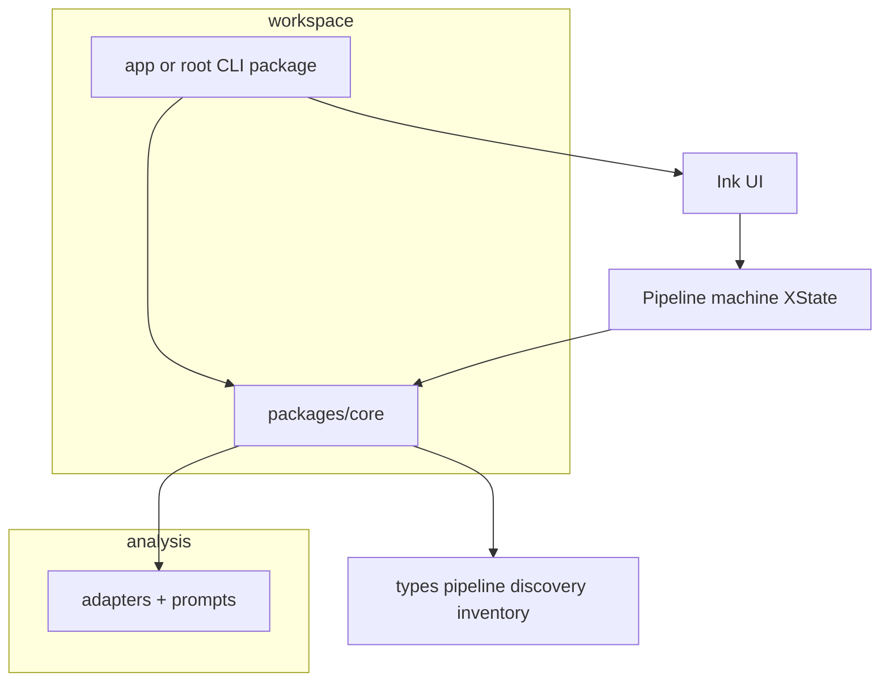

# Eng review: refactor roadmap (agent-cv)

## Reviewed artifact

This plan started from the **prior session direction** (smaller god-component, cleaner `pipeline`) and was **expanded per your request** to include monorepo core extraction, XState, adapter/prompt work, and CI/release. Ground truth references: [`src/components/Pipeline.tsx`](src/components/Pipeline.tsx), [`src/lib/pipeline.ts`](src/lib/pipeline.ts), [`src/lib/types.ts`](src/lib/types.ts), [`test/pipeline.test.ts`](test/pipeline.test.ts), [`TODOS.md`](TODOS.md).

---

## Scope tiers

| Tier | What | Risk / effort |
|------|------|----------------|
| **Lake** | Split [`pipeline.ts`](src/lib/pipeline.ts), typed inventory extras, extract GitHub cloud from [`Pipeline.tsx`](src/components/Pipeline.tsx), optional Zod, CLI version sync | Low blast radius if done in small PRs with `bun test` |
| **Ocean** | Workspaces + `packages/core`, XState for UI pipeline, adapter/prompt rewrites, CI/release | Cross-cutting; needs strict sequencing and parity checks |

---

## Step 0: Scope challenge (updated)

| Question | Answer |
|----------|--------|
| What already solves part of this? | Same as before: pipeline helpers tested, inventory store centralized. |
| Minimum change that helps most? | **Still:** mechanical split + extract cloud block first (fast feedback). Ocean items **after** lake stabilizes, or **in parallel branches** with frequent merges from main. |
| Complexity check | **Now explicitly multi-phase:** expect **more than 8 files** and **new packages** — acceptable because you asked to widen scope; mitigate with one ocean initiative at a time per merge window. |
| Search / built-ins | **Lake:** `useReducer` still fine for small steps. **Ocean:** XState is **[Layer 2]** — justified once phase logic must be tested independently of Ink and you want explicit transitions. |

**Completeness:** Keep `bun test` green after every merge; for adapters/prompts add **golden or eval** coverage before declaring parity.

---

## Phase A — Lake (unchanged intent)

1. Split [`src/lib/pipeline.ts`](src/lib/pipeline.ts) + barrel re-exports; `bun test`.
2. Typed `githubExtras` / `publishedPackages` on [`Inventory`](src/lib/types.ts); remove `as any`.
3. Extract GitHub cloud orchestration from [`Pipeline.tsx`](src/components/Pipeline.tsx); unit tests with mocked `GitHubClient`.
4. **Locked:** Zod in `readInventory` (parse/validate inventory shape) in Phase A; sync with [`TODOS.md`](TODOS.md) migration narrative.
5. Sync [`src/cli.ts`](src/cli.ts) version with [`package.json`](package.json).

---

## Phase B — Monorepo `packages/core` (now in scope)

**Goal:** Publishable or at least importable **core** package: types, pipeline orchestration, discovery (scanner, git, GitHub client usage), inventory — **no Ink/React**.

- **Workspace tool:** Prefer **Bun workspaces** (single lockfile, matches current runtime) — add `workspaces` in root [`package.json`](package.json), create `packages/core/package.json` with `name` (e.g. `@agent-cv/core` aligned with product naming).
- **Boundary:** `packages/core` must not import from `src/components/**`. CLI/TUI package depends on `core` + `ink` + `react`.
- **Migration strategy:** Move modules incrementally; re-export from old paths temporarily **or** one cutover PR after `bun test` passes with updated imports.
- **Tests:** Run `bun test` from repo root; optionally `packages/core` has its own `test/` or inherits root — pick one convention and document in plan commit.
- **DX (from `/plan-devex-review` + AskQuestion):** **Root [`CONTRIBUTING.md`](CONTRIBUTING.md)** (clone, Bun, `bun install`, `bun test`, package layout); **one-line link** from [`README.md`](README.md). [`packages/core/README.md`](packages/core/README.md) with `exports` / intended imports; **CHANGELOG** entry for workspace layout. **Phase E v1:** `bun test` only on PR/push — **no `tsc --noEmit` in v1** (AskQuestion lock; optional typecheck later).

**Blast radius:** High — schedule after Phase A or freeze `main` during cutover.

---

## Phase C — XState (or compatible state machine) for Pipeline (now in scope)

**Goal:** Replace ad-hoc `phase` string + multiple `useEffect` guards with a **single machine** for the generate/publish pipeline UI.

- **Library:** **XState v5** + `@xstate/react` is the usual stack; alternative is **robot** or hand-rolled reducer — document choice in PR. Plan assumes **XState** as named.
- **Integration:** Ink components **subscribe** to machine state (`useSelector` / `useMachine`); side effects (async scan, analyze) as **invoked actors** or `fromPromise` so phases stay testable without terminal.
- **Parity:** Golden path + skip paths (`shouldSkipPhases`) must match current behavior; add **machine unit tests** (transition table) before swapping UI wiring.

**Dependency:** Easier **after** Phase B if core owns async steps and UI only sends events — otherwise duplicate orchestration in machine vs `pipeline.ts`. Preferred: **core exposes commands**, machine orchestrates **when** to call them.

---

## Phase D — Adapters and LLM prompts (now in scope)

**Goal:** Harden [`src/lib/analysis/*-adapter.ts`](src/lib/analysis/) and prompt assembly without silent regressions.

- **Locked approach:** **Planned sweeps** — one adapter **family** per PR, ordered batch: **API adapter(s) first**, then **CLI-style agents** (claude, codex, cursor, etc.), not only reactive fixes when something breaks.
- **Scope:** Refactor for clarity (shared parsing, consistent errors), **not** necessarily new models.
- **Safety net:** Extend [`PROMPT_VERSION`](src/lib/types.ts) when templates change; add **snapshot or fixture tests** on structured outputs where adapters parse JSON/markdown.
- **Cross-link:** [`TODOS.md`](TODOS.md) “Agent CLI stability monitoring” (version detection) pairs well with this phase — bundle or sequence.

**Risk:** Highest user-visible blast radius — the sweep order keeps each PR reviewable.

---

## Phase E — CI and release pipeline (now in scope)

**Goal:** Automation beyond local `bun test` and manual `prepublishOnly`.

- **Locked v1:** Workflow runs **`bun test` on push/PR** only (no mandatory `tsc --noEmit` in the first workflow). Add typecheck or stricter gates later if you want.
- **Release:** Document or automate: version bump, `build:npm`, npm publish — align with existing [`package.json`](package.json) `prepublishOnly` / `files` / `bin` (can follow after the test workflow is green).
- **Optional later:** Binary build `build:binary` on release tags, separate workflow.

---

## Architecture diagram (target end state)



---

## Code quality (findings — still valid)

- Remove `(inventory as any)` (Finding 4).
- CLI version sync (Finding 5).

---

## Test review (expanded)

| Area | Requirement |
|------|-------------|
| Core package | All existing tests green; core-only tests for pure modules |
| XState | Transition tests + one Ink smoke or machine-only integration |
| Adapters | Per-adapter golden/snapshot or eval; bump `PROMPT_VERSION` when prompts change |
| CI | Workflow must fail on test failure; required check on `main` |

---

## Performance

- Core extraction must not duplicate heavy work; XState should not add perceptible overhead vs current React state (machines are lightweight; watch **re-renders** in Ink).

---

## NOT in scope (remaining)

- Full product rewrite or new UX for unrelated commands.
- Replacing Bun with another runtime.
- Anything not listed in Phases A–E unless added in a future plan revision.

---

## What already exists (reuse)

- [`TODOS.md`](TODOS.md): inventory migration, CLI version checks — align Phase D/E with those items where relevant.
- [`package.json`](package.json) scripts: `build:npm`, `prepublishOnly`, `build:binary` — **extend**, do not rip out.

---

## Parallel worktrees (updated)

| Lane | Work | Depends on |
|------|------|------------|
| A | Phase A lake refactors | — |
| B | Phase B monorepo + core | Prefer after A |
| C | Phase C XState | Core API stable (B ideal) |
| D | Phase D adapters | Can lag B/C if imports stable |
| E | Phase E CI | After A–D per locked order (not parallel to A) |

**Conflict:** B + C both may touch `Pipeline.tsx` / pipeline entrypoints — **serialize B then C** unless you use a long-lived integration branch.

---

## Failure modes (additional)

| Failure | Mitigation |
|---------|------------|
| Workspace path breaks imports | Single `tsconfig` references or per-package `tsconfig`; one verification command in CI |
| XState diverges from real CLI | Parity checklist + machine tests before removing old phase code |
| Adapter rewrite breaks parsing | Golden tests + staged rollout per adapter |
| CI flaky on Bun | Pin Bun version in workflow |

---

## Recommended implementation order (full scope)

1. **Phase A** (lake) — merge in small PRs.
2. **Phase B** (monorepo + core) — one focused milestone; green CI locally before push.
3. **Phase C** (XState) — after core boundary is clear.
4. **Phase D** (adapters/prompts) — parallel track only if it does not block B/C merges.
5. **Phase E** (CI/release) — **Locked:** after C/D track as chosen; not immediately after A (no green-CI gate before B/C/D unless you add an ad-hoc local habit).

---

## GSTACK-style completion (for dashboards)

- **Step 0:** Scope **expanded** to include ocean-tier items; sequencing above.
- **Outside voice:** Optional after Phase A or before Phase D.
- **Lake score:** Ocean items trade short-term velocity for long-term testability — intentional per your scope change.

---

## What else (full `/plan-eng-review` vs this doc)

The gstack skill also expects: per-section interactive decisions, `gstack-review-log`, Review Readiness Dashboard, a **test plan artifact** under `~/.gstack/projects/{slug}/`, optional **Codex outside voice**, and per-TODO `AskUserQuestion` → [`TODOS.md`](TODOS.md). None of that blocks implementation; run or approximate when you want audit trail parity.

**Substantive items not fully locked in the phases above (decide before / during Phase B–E):**

| Topic | Why it matters |
|-------|----------------|
| **Package naming** | Root [`package.json`](package.json) is `agent-cv`; repo folder matches (`agent-cv`). For workspaces, pick **`@agent-cv/core`** (or another scope) and document it once. |
| **`packages/core` public API** | Decide what is exported semver-stable vs internal. Telemetry ([`src/lib/telemetry.ts`](src/lib/telemetry.ts)): inject from CLI or optional peer — avoid core → PostHog coupling if core must stay headless. |
| **Publishing `core`** | If `@agent-cv/core` ships to npm separately, add version policy and **changesets** or manual bump; aligns with Phase E. |
| **Semver / breaking changes** | Monorepo split may change import paths for contributors; note in CHANGELOG or ONBOARDING one-liner. |
| **CI matrix** | Phase E: pin **Bun version**, target **os** (ubuntu + optional macos) if you care about path-sensitive tests. |
| **Binary releases** | [`package.json`](package.json) has `build:binary`; optional GitHub Releases job for tagged builds (not required for npm CLI). |
| **Design review** | Phase C (XState + Ink) touches terminal UX; optional `/plan-design-review` or a short **parity checklist** (phases, errors, skip paths). |
| **CEO / product review** | Done — SELECTIVE EXPANSION; AskQuestion locked workspace-only core, C after B, E last. |

**Tests the diagram should eventually cover (add when implementing):** XState transition table (all `Phase` equivalents), GitHub cloud module branches (auth skip, partial errors), one **eval or golden** path per adapter family touched in Phase D ([→EVAL] in skill terms).

---

## CEO review (`/plan-ceo-review`)

**Mode: SELECTIVE EXPANSION** — Hold the engineering outcome (healthier codebase, testable pipeline, shippable CI) while cherry-picking **one** ocean-sized bet at a time so you do not spend six months with zero user-visible delta.

### Job to be done (reframe)

Users do not want a monorepo. They want **a credible portfolio artifact** (markdown, publish URL) with **minimal shame** (privacy, accurate project list, fair credit for OSS). Refactors are **enabling work**: they matter if they shorten the loop from “I changed my repos” to “my page reflects it” and reduce support burden (flaky adapters, confused terminal states).

**10-star bar (product, not architecture):** One command, clear progress, recoverable failures, output that matches their story, trust on data leaving the machine. Code quality is how you get there sustainably, not the headline.

### Premises challenged

| Premise | Challenge |
|---------|-----------|
| “We need `packages/core` on npm” | **Maybe not.** If no external consumer is signed up, core can live as a **workspace package only** (simpler release, one version). Publishing `@agent-cv/core` is a **distribution and semver promise** — do it when there is a second consumer or a partner ask. |
| “XState is required” | XState pays off when **phase bugs** cost real support time. If Phase A already kills the worst Ink spaghetti, XState is **optional polish** unless you measure confusion/regressions. Keep it in plan but **time-box** Phase C proof (machine + parity tests) before full UI migration. |
| “Rewrite all adapters” | Highest **user-visible** risk. Prefer **one adapter family at a time** tied to incidents or roadmap (e.g. API mode for paying users). Tie to [`TODOS.md`](TODOS.md) CLI stability — that is customer-facing narrative. |
| “CI is Phase E late” | CEO argued for E right after A; **you locked E last** (A→B→C→D→E). Tradeoff: less branch protection until E lands; accept or revisit. |

### Strategic recommendations (opinionated)

1. **Ship Lake first** — CEO originally paired this with minimal CI; **you locked CI (E) for the end of the train.** Mainline is unprotected by GitHub Actions until E; mitigate with local `bun test` discipline before merge.
2. **Name the “second customer” for core** — If the answer is “none yet,” keep core **private to the repo** until a clear embed or partner path. Avoid npm scope debates until then.
3. **Telemetry boundary** — Keep PostHog and device flows in the **CLI layer**; core stays boring and forkable. Matches trust story for privacy-conscious developers.
4. **One innovation token per quarter (informal)** — Monorepo, XState, adapter overhaul each burn focus. Serializing B → C → D with **explicit “done” demos** (internal dogfood) beats parallel half-done streams.
5. **Visible win between phases** — After Phase A, ship a **user-facing note** (CHANGELOG, tweet, site): faster scans, clearer errors, whatever is true. Refactors die in silence without narrative.

### Optional expansions (not committed — backlog)

- **SDK / embed story:** Document-only “how to call core from your tool” before building a public API surface.
- **Team / org mode:** Only if ICP shifts from solo dev to eng orgs; otherwise defer.
- **Hosted run:** CI action that runs agent-cv on a repo — distribution play, separate product decision.

### CEO verdict on current phase order

| Phase | CEO stance |
|-------|------------|
| A (Lake) | **Do.** Low regret, enables everything else. |
| E (CI) | CEO had suggested moving E up after A; **locked:** keep **Phase E in original eng order** (after A–D track as planned), not immediately after A. |
| B (Monorepo) | **Do** when A is green; justify with contributor velocity or embed path. |
| C (XState) | **Locked:** ship XState in the **release right after Phase B stabilizes** (must-have for that window); still use machine tests + parity. |
| D (Adapters) | **Locked:** planned sweeps (API first, then CLI agents), not reactive-only. |

### Locked decisions (AskQuestion)

| Topic | Choice |
|-------|--------|
| **`packages/core` on npm** | **Workspace-only** for Phase B. No public `@agent-cv/core` on npm until a second consumer justifies it. |
| **Phase C (XState) timing** | **Must** land in the release **after Phase B is stable** (not optional “maybe later” after A alone). |
| **Phase E (CI) timing** | **Original eng order:** do not pull minimal CI immediately after A; E stays as in recommended A → B → C → D → **E** sequence (user override vs CEO “E early”). |
| **Zod + inventory** | **In Phase A** — validate `readInventory` with Zod, not deferred. |
| **Phase D style** | **Planned sweeps:** one family per PR; **API batch first**, then CLI agents. |
| **Phase E first workflow** | **`bun test` only** on push/PR; typecheck / release automation optional later. |

---

## Plan design review (`/plan-design-review`)

**Scope:** Design critique applies to **terminal / Ink TUI** (generate/publish pipeline), especially **Phase C** (XState + Ink). Web marketing UI is out of scope for this roadmap. No `DESIGN.md` in repo; calibration uses universal TUI principles + existing [`Pipeline.tsx`](src/components/Pipeline.tsx) patterns (`Phase` union, `useInput`, clear-screen on interactive steps).

**Scores:** initial design completeness **5/10** (strong architecture, thin on user-visible states and copy parity). After additions below: **7/10** body text; **Pass 7 closed** via AskQuestion — design decisions for Phase C are **locked** (see table below).

### Pass 1 — Information architecture (6/10 → 8/10)

**Gap:** Plan orders work A→E but does not spell **what the user reads first → last** during one generate run (status lines, phase titles).

**Fix:** Treat IA as **phase order + primary line of copy** per step. Phase C machine must preserve or improve today’s hierarchy: global progress notion before nested details. Add explicit **parity checklist**: map each `Phase` in [`Pipeline.tsx`](src/components/Pipeline.tsx) to a machine state id and one **primary user-facing label** (same string or intentional rename with CHANGELOG note).

### Pass 2 — Interaction state coverage (5/10 → 7/10)

**Gap:** No table for loading / empty / error / success / partial for pipeline screens.

**Fix — TUI state matrix (target for Phase C):**

| Flow moment | LOADING | EMPTY | ERROR | SUCCESS | PARTIAL |
|-------------|---------|-------|-------|---------|---------|
| Scan repos | Spinner or “Scanning…” | No projects found (action: check path) | Scan failed (message + retry hint) | N projects found | Some paths skipped (warn list) |
| GitHub cloud merge | “Fetching…” | No GH user / skip cloud | Auth / rate limit | Merged cloud rows | Partial API failure (what still applied) |
| Analyze | Model progress | — | `analysis-failed` branch | Done / next step | Some projects failed analysis |
| Publish (if shared UI) | — | — | Network / API | Published URL | — |

**Deferred to implementation:** exact copy strings; snapshot tests should lock them.

### Pass 3 — User journey and emotional arc (6/10 → 7/10)

**Gap:** CEO section names trust; plan does not tie **long-running scan** to reassurance (time anxiety).

**Fix:** In Phase C PR, specify **>N seconds** behavior: throttled status updates or elapsed time, no silent stretches >10s without a line change. Aligns with “credible portfolio artifact” narrative.

### Pass 4 — Generic / “slop” risk in TUI (7/10 → 8/10)

**Gap:** XState could multiply generic “Loading…” lines.

**Fix:** Require **specific verbs** per state (“Scanning disk”, “Calling GitHub API”, “Merging inventory”) and forbid duplicate stacked spinners without hierarchy. Golden/snapshot tests on **rendered text** for one happy path + one failure path.

### Pass 5 — Design system alignment (3/10 → 6/10)

**Gap:** No `DESIGN.md`; plan does not define Ink **tone** (colors, symbols, error styling).

**Fix:** Either add a short **TUI conventions** subsection (success/dim/warning colors, when to use `Box` vs `Text`), or schedule `/design-consultation` **only** if you want a full brand pass. For OSS CLI, a **one-page `docs/tui.md`** in Phase C is enough for 8/10.

### Pass 6 — Responsive and accessibility (5/10 → 7/10)

**Gap:** No **minimum terminal width**, no note on keyboard-only use.

**Fix:** Document **min columns** (e.g. 80) and behavior when narrower (truncate with ellipsis vs wrap). List **keyboard**: Enter/Esc/ arrows in pickers (`ProjectSelector`, `AgentPicker`). Screen-reader: terminal a11y is limited; state **“best effort”** (consistent order of announcements via static layout, no flicker without clear).

### Pass 7 — Design decisions (AskQuestion locked)

| Decision | Locked choice (Apr 2026) |
|----------|--------------------------|
| **XState state ids vs today `Phase` strings** | **New machine ids** (e.g. SCREAMING_SNAKE) + **single module** (e.g. `phaseMachine.ts`) that maps ↔ legacy [`Phase`](src/components/Pipeline.tsx) for parity and tests. |
| **Inline error copy** | **Short message + in-session expand** — user sees a concise line; optional key/hint to show details (no default stack dump in TUI). |
| **Telemetry notice vs progress** | **Blocking banner on first run only**, then normal progress; formalize today’s `showTelemetryNotice` idea as an explicit machine transition, not buried behind progress. |

**Previously unresolved — now closed** (supersedes the earlier “if deferred” table for implementation).

### Design — NOT in scope (explicit)

- Marketing site / README visual redesign.
- New logo, color brand system (unless `docs/tui.md` counts as minimal).
- Non-terminal GUIs.

### Design — reuse from codebase

- [`Pipeline.tsx`](src/components/Pipeline.tsx): `Phase` type, interactive full-screen clear, step ordering.
- Existing Ink components: `ProjectSelector`, `EmailPicker`, `AgentPicker` (keyboard patterns).

### Optional TODOS.md (design debt)

- Add **TUI parity snapshot** task for Phase C.
- Add **min terminal width** note to user-facing docs when `docs/tui.md` lands.

---

## Plan developer experience review (`/plan-devex-review`)

**Mode: DX POLISH** (not DX EXPANSION). The roadmap optimizes architecture and testability; the main DX risk is **contributor friction** (monorepo, import churn, CI late), not end-user `npm install -g` flow. End-user story stays strong in [`README.md`](README.md); this review stresses **clone → test → PR** and **package boundaries**.

**Product type:** CLI + library-shaped core (`packages/core`). **Persona:** primary **repo contributor**; secondary **downstream consumer** only after a second consumer exists (workspace-only core is already locked).

### Step 0 evidence (repo)

| Signal | Finding |
|--------|---------|
| End-user quick start | [`README.md`](README.md): `npm install -g agent-cv` + `agent-cv publish` / `generate` — clear; not changed by this plan. |
| Contributor path | [`package.json`](package.json): `bun test`, `bun run dev` → [`src/cli.ts`](src/cli.ts). **AskQuestion:** add root **`CONTRIBUTING.md`** + README link with Phase B. |
| Version drift | [`src/cli.ts`](src/cli.ts) `.version("0.1.0")` vs [`package.json`](package.json) `"0.1.2"` — **DX bug**; Phase A `cli-version-sync` covers it. |
| CI | Phase E last — **no PR gate** until then; contributors rely on discipline + local `bun test` (already noted in CEO section). |

**TTHW (contributor, estimated):** clone + install + `bun test` ≈ **5–15 min** on a clean machine with Bun (not instrumented). **Target after Phase B+E:** document path so **&lt;10 min** to green test + visible CI on PR.

### Competitive / reference (CLI tier)

| Product | Getting started | Note |
|---------|-----------------|------|
| agent-cv (today) | npm global + command | Strong README |
| Similar CLIs | `gh`, `vercel` | Mature `--help`, non-interactive flags |

Gap is not marketing; it is **multi-package contributor docs** once workspaces land.

### Eight DX dimensions (0–10, evidence-linked)

| Dimension | Score | Notes |
|-----------|-------|--------|
| **Getting started** (contributor) | **7/10** (after AskQuestion) | **Locked:** root `CONTRIBUTING.md` + README pointer; ship with Phase B. |
| **CLI / “API” surface** (commands, flags) | **7/10** | Phase A syncs version; Phase D adapter sweeps help consistent errors. **Fix:** note in Phase B that **public surface** for `@agent-cv/core` is `package.json` `exports` + one `README` in `packages/core` (even if workspace-only). |
| **Errors** | **8/10** | Design review locked short message + in-session expand — aligns with DX. |
| **Docs / discoverability** | **5/10** | Refactor plan does not tie releases to **CHANGELOG** or **migration** blurb for import path changes. **Fix:** Phase B PR includes **CHANGELOG** entry + one paragraph for contributors on import updates. |
| **Upgrades / semver** | **6/10** | Plan mentions semver/breaking imports; **Fix:** state **patch** bumps for Lake PRs, **minor** when `packages/core` public API widens. |
| **Dev environment** | **7/10** | Phase E matrix: pin Bun in workflow (already in failure modes). **Fix:** same Bun version in `package.json` `engines` or `volta`/`mise` pin optional. |
| **Community** | **4/10** | Out of scope; no change. |
| **Measurement** | **5/10** | Phase E adds tests on PR; no **DX metric** (e.g. time-to-green). **Fix (optional):** document “run `bun test` before push” in CONTRIBUTING; optional `bun test` timing in CI later. |

**Overall DX score (plan-level):** **6/10 → 7/10** after Phase B docs; **7.5/10** at plan level once AskQuestion locks (CONTRIBUTING path, no tsc in CI v1) are reflected in shipped files.

### Magical moment (contributor)

After Phase B: **one command from root** (`bun test`) still passes and **importing from `@agent-cv/core`** in the CLI package works without path hacks — that is the moment to celebrate in the Phase B PR description.

### Friction points → plan edits (applied in prose below)

1. **Phase B** — **CONTRIBUTING.md** (AskQuestion), `packages/core/README.md`, CHANGELOG (unchanged intent).
2. **Phase A** — Keep `cli-version-sync` as **first-class** (impacts `--version` trust).
3. **Phase E** — **v1:** `bun test` only (AskQuestion); optional **`tsc --noEmit`** only in a **later** workflow/PR, not part of first CI ship.

### DX — NOT in scope

- Rewriting end-user README flow.
- npm download stats or community growth tactics.
- Full **/devex-review** live CLI audit (run **after** Phase C per skill “boomerang”).

### Locked decisions (AskQuestion — DX)

| Topic | Choice |
|-------|--------|
| **Contributor docs** | **Root `CONTRIBUTING.md`** + **one-line link** in [`README.md`](README.md) (not README-only Developing section). |
| **Phase E CI v1** | **`bun test` only** — do **not** add `tsc --noEmit` in the first CI workflow; typecheck is a later optional PR. |

---

## Plan engineering review (`/plan-eng-review`)

**Artifact:** this roadmap (Lake + Ocean). **Test plan file:** `~/.gstack/projects/agent-cv-agent-cv/devall-master-eng-review-test-plan-20260409-002947.md` (for `/qa` / `/qa-only`).

### Step 0 — Scope challenge

| Question | Answer |
|----------|--------|
| **Reuse** | Existing [`test/pipeline.test.ts`](test/pipeline.test.ts), [`test/remote-grouping.test.ts`](test/remote-grouping.test.ts), discovery modules — plan extends rather than forks. |
| **Minimum change** | **Lake (A)** alone improves trust (Zod, `--version`); Ocean phases are **sequential**, not one mega-PR. |
| **Complexity** | **>8 files / new packages** — smell acknowledged; mitigations: **one phase per PR**, **no parallel edits** to `pipeline.ts` + `Pipeline.tsx` + nascent `packages/core`, barrel re-exports during split. |
| **TODOS** | [P1] inventory migration in [`TODOS.md`](TODOS.md) — **not blocking** Zod read path but **should follow** or ship with version field to avoid double-migration. |
| **Completeness** | Plan already chose “lake” completeness on typed inventory + tests; Ocean deferred where noted. |
| **Distribution** | npm `core` **deferred** per CEO lock; CI **tests-only v1** per DX lock. |

**Scope at eng gate:** **Accepted as serialized phases** (no further cut here; CEO + DX + Design locks already bound scope).

### Prior learnings

Cross-project learnings search skipped in this environment; no prior learning lines to merge.

### 1. Architecture

| ID | Severity | Conf | Finding |
|----|----------|------|---------|
| A1 | P2 | 8/10 | **Dual orchestration risk:** XState machine + `runPipeline` + future `core` commands could each own “what runs next.” **Mitigation (plan-level):** after Phase B, **one command layer** in `packages/core` (pure inputs → effects); **machine calls that layer only**; [`Pipeline.tsx`](src/components/Pipeline.tsx) does not re-implement scan steps. Document “forbidden: duplicate long-running scan in machine and `pipeline.ts`.” |
| A2 | P2 | 8/10 | **Telemetry sink:** PostHog / `posthog-node` stays in **CLI package** — [`src/lib/telemetry.ts`](src/lib/telemetry.ts) must not move into `core` (CEO + DX alignment). |
| A3 | P3 | 6/10 | **README drift:** When `packages/core/README.md` lands, **link** to root README for install story — avoid two sources of truth for OSS consumers. |

**Production failure scenarios (new paths):**

- **Machine + lib mismatch** — user sees wrong phase label or stuck spinner; **mitigation:** single `phaseMachine` → legacy `Phase` map (Design Pass 7 locked) + unit tests on map.
- **Core extracted but CLI still imports old path** — build breaks; **mitigation:** Phase B checklist: grep for `from '../lib/pipeline'` after moves.

### 2. Code quality

| ID | Severity | Conf | Finding |
|----|----------|------|---------|
| Q1 | P2 | 8/10 | **God files:** [`src/lib/pipeline.ts`](src/lib/pipeline.ts) / [`src/components/Pipeline.tsx`](src/components/Pipeline.tsx) — plan already schedules split + GitHub extraction; **DRY** after extraction: one place for “enrich GitHub” orchestration. |
| Q2 | P2 | 7/10 | **`(inventory as any)`** — Phase A typed fields + Zod; aligns with explicit > clever. |

### 3. Test review

**Framework:** `bun test`, tests under [`test/`](test/). No dedicated `## Testing` in [`CLAUDE.md`](CLAUDE.md) — recommend adding one line when CONTRIBUTING lands (Phase B).

**ASCII coverage (planned workstreams — pre-implementation):**

```
CODE PATH COVERAGE (planned refactors)
====================================
[+] readInventory + Zod (Phase A)
    ├── [GAP] valid JSON, invalid shape → Zod error message
    ├── [GAP] valid shape → same downstream behavior as today
    └── [GAP] migration/version — tie to TODOS P1 when field added

[+] packages/core command API (Phase B)
    ├── [GAP] machine invokes core — integration-style test or contract test
    └── [GAP] telemetry still only from CLI — smoke import test

[+] pipeline.ts split (Phase B)
    ├── [★★  PARTIAL] existing pipeline tests — extend per moved module
    └── [GAP] each new module: at least one unit test for public exports

[+] GitHub cloud extraction (Phase B)
    ├── [GAP] mock GitHubClient — deterministic tests
    └── [GAP] rate-limit branch — assert user-visible warning path

USER FLOW COVERAGE (TUI — post Phase C)
====================================
[+] Phase transitions + errors (Design Pass 7)
    ├── [GAP] [→E2E or ink-test] short error + expand in session
    └── [GAP] first-run telemetry banner then progress

─────────────────────────────────
COVERAGE: plan-stage — most paths [GAP] until implementation
QUALITY: target ★★★ on pure libs; ★★ on orchestration
─────────────────────────────────
```

**Regression rule:** any behavior change in `runPipeline` or inventory read gets a **CRITICAL** test before merge.

**Eval:** Prompt/bio-generator edits → follow [`CLAUDE.md`](CLAUDE.md) eval patterns if those files move.

### 4. Performance

| ID | Severity | Conf | Finding |
|----|----------|------|---------|
| P1 | P3 | 7/10 | **GitHub fan-out** — unchanged from current risk; Phase D adapter sweep should not add **uncached** duplicate calls for same repo in one run. |

### NOT in scope (eng)

- Rewriting discovery algorithms (unless a phase explicitly does).
- npm publish automation for `core` (deferred).
- `tsc` in CI v1 (DX lock).

### What already exists

| Area | Exists today | Plan reuse |
|------|--------------|------------|
| Pipeline tests | [`test/pipeline.test.ts`](test/pipeline.test.ts) | Extend as modules split |
| Remote grouping | [`test/remote-grouping.test.ts`](test/remote-grouping.test.ts) | Keep; do not duplicate logic in TUI |
| Telemetry helper | [`src/lib/telemetry.ts`](src/lib/telemetry.ts) | CLI-only boundary |
| TODOS | Inventory P1, agent CLI P2 | Link Zod + migration |

### Failure modes (plan-level)

| Failure | Test? | Handling? | User-visible? |
|---------|-------|-----------|---------------|
| Invalid inventory after Zod | GAP → add in A | Zod throws / mapped error | Yes if message wired |
| Dual orchestration bug | GAP | Code review + single owner | Wrong phase / stuck UI |
| Telemetry in core by mistake | Import test | Split packages | Subtle wrong bundling |

**Critical gap:** none **if** A1 mitigation (single command layer) is enforced in Phase B/C PR descriptions.

### Worktree parallelization

**Sequential implementation, no parallelization** for `pipeline.ts` / `Pipeline.tsx` / `packages/core` — same as B+C conflict note. **Parallel OK:** unrelated docs-only PR; new tests in `test/` that do not touch pipeline exports until barrel stabilizes.

### Outside voice

Codex previously **429**; optional second opinion after quota reset. No new Codex run in this pass.

### Completion summary (eng)

| Metric | Value |
|--------|-------|
| Step 0 | Scope **accepted** (serialized phases) |
| Architecture | **3** findings (A1–A3) |
| Code quality | **2** findings (Q1–Q2) |
| Tests | Diagram + **gaps** enumerated (implementation fills) |
| Performance | **1** finding (P1) |
| NOT in scope / What exists | **Yes** |
| Failure modes | **0** critical gaps if A1 enforced |
| Outside voice | **Skipped** (quota / prior block) |
| Parallelization | **Sequential** for core refactor lane |

**Lake score:** recommendations favor **complete** Zod + tests per phase over shortcuts.

---

## GSTACK REVIEW REPORT

| Review | Trigger | Why | Runs | Status | Findings |
|--------|---------|-----|------|--------|----------|
| CEO Review | `/plan-ceo-review` | Scope and strategy | 1 | Documented + AskQuestion | SELECTIVE EXPANSION; core workspace-only; C after B; E order per eng; D sweeps; Zod in A; CI v1 tests-only |
| Codex Review | `/codex review` | Second opinion on diff | 1 | **BLOCKED** | API 429 — OpenAI Codex usage limit (free); no review text captured |
| Cursor Agent | `cursor-agent --plan --print --trust` | Second opinion when Codex unavailable | 1 | **PASS** | No [P1]; multiple [P2] (silent `enrichGitHubData` catch, `incomplete_results` upstream search, `paginate` partial on non-OK, telemetry flush missing on `generate`, PostHog default key in OSS, untracked JSON hygiene, integration test gaps) |
| Eng Review | `/plan-eng-review` | Architecture and tests | 1 | **CLEAR (PLAN)** | Step0 serialized scope; A1 dual-orchestration boundary; A2 telemetry CLI-only; A3 README link; Q1/Q2 pipeline+inventory; test diagram + gaps; P1 GitHub fan-out; failure modes; test plan artifact `~/.gstack/projects/agent-cv-agent-cv/devall-master-eng-review-test-plan-20260409-002947.md` |
| Design Review | `/plan-design-review` | TUI / Phase C Ink+XState | 1 | **CLEAR (decisions locked)** | score 5→7/10; Pass 7 closed via AskQuestion: machine ids+map, error short+in-session expand, telemetry first-run banner then progress |
| DX Review | `/plan-devex-review` | Contributor + CLI surface | 1 | **CLEAR (AskQuestion)** | DX POLISH; CONTRIBUTING.md + README link; Phase E v1 stays tests-only (no tsc); ship docs with Phase B; live /devex-review after Phase C |

- **CODEX:** Run `codex review --base master` locally after quota reset or upgrade ChatGPT Plus. Codex CLI (v0.98) does not combine custom PROMPT with `--base` or `--uncommitted`; use default review or newer CLI.
- **CURSOR AGENT:** Same headless review command as above; `git` in agent sandbox was rejected — review used file reads + known branch status. For stricter diff fidelity, attach `git diff` output or run where shell is allowed.

**VERDICT:** **Eng review** — section `Plan engineering review (/plan-eng-review)` + test plan artifact; **CLEAR (PLAN)** with findings above; `gstack-review-log` for `plan-eng-review` at `271bb38`. **CEO + AskQuestion** locks unchanged. Phase A includes Zod; B then C; D as API→CLI sweeps; E last with test-only CI v1; no npm `core` until you revisit. Independent second opinion: **Cursor Agent PASS** (no P1); Codex still blocked on quota. **Design review:** TUI section + **Pass 7 locked** (machine map, error expand, telemetry banner); optional `docs/tui.md` still useful for tokens/width.

**DESIGN:** Pass 7 decisions **locked** (AskQuestion): `phaseMachine` map to legacy `Phase`; TUI errors short + expand in session; telemetry = first-run blocking banner then progress.

**DX:** `/plan-devex-review` + **AskQuestion**: **`CONTRIBUTING.md`** + README one-liner; **no `tsc` in CI v1**. Implement docs in Phase B; **`/devex-review`** live after Phase C.
