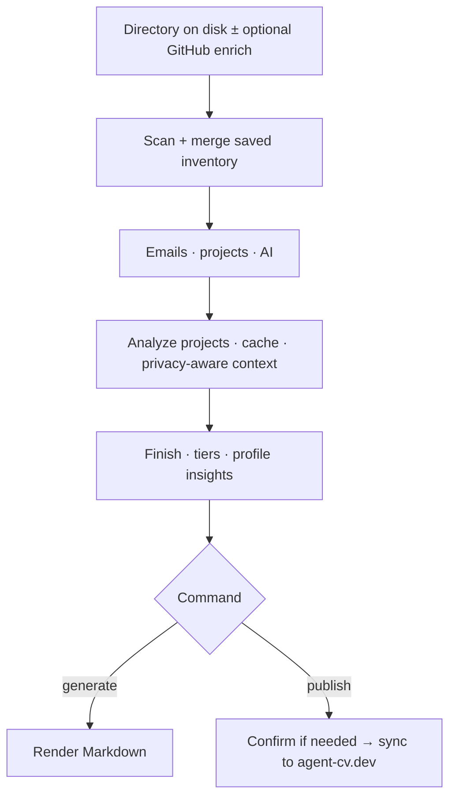

# agent-cv


> **agent-cv — Your code tells a story**

Most profiles stop at what GitHub shows publicly. Yours also lives on disk: branches that never got pushed, work behind NDA, weekend spikes in odd stacks, years of commits under addresses you forgot. **agent-cv** scans a folder tree (and optionally augments from GitHub), reads git history, READMEs, and dependency markers, then asks **Claude Code, Codex, Cursor**, or any **OpenAI-compatible API** you already run to describe each project. That work runs on your machine until you publish; you choose what becomes a public page at [agent-cv.dev](https://agent-cv.dev) or a **markdown file** you own.

Try it locally:
```bash
npx agent-cv generate ~/Projects
```

Or publish it to the web:
```bash
npx agent-cv publish
```
[Example profile →](https://agent-cv.dev/beautyfree)

## How it works

### 1. Try locally

No account, no sign-up. `npx` downloads agent-cv, finds your projects, asks which to include, and generates AI descriptions. Everything stays on your machine.

```bash
npx agent-cv generate ~/Projects
```

### 2. Like it? Publish.

One more command to put it on the web. GitHub login for your username. You review everything before it goes live.

```bash
npx agent-cv publish
```

### 3. Customize

Edit your bio, reorder projects, hide what you don't want to show.

→ `agent-cv.dev/yourusername/edit`

## Privacy

| **Published** | **Never published** |
|---------------|---------------------|
| Project names you included, AI-written descriptions, stacks, coarse activity | Paths on your machine |
| Commit counts and dates | Source code or file contents |
| GitHub links (**public** repos only) | Private repo URLs, secrets, `.env`, credentials |
| | Raw email addresses |

Repo and CLI behavior are inspectable on [GitHub](https://github.com/agent-cv/agent-cv). Legal: [Terms of Service](https://agent-cv.dev/terms).

## Features

**Descriptions from real repos, not boilerplate**  
The model sees your tree and metadata; output is specific to that project.

**Sees what GitHub cannot**  
Git history and folders are local first — private and internal work counts.

**Nothing ships without you**  
Pick emails and projects before analysis; publish is explicit.

**Re-run when life moves**  
New quarter, new job, new side project — run again; the profile catches up.

## Also

**Stack over time** — languages, frameworks, activity patterns.

```bash
npx agent-cv stats ~/Projects
```

**Markdown out** — job forms, README “about me”, anywhere plain text wins.

```bash
npx agent-cv generate ~/Projects --output cv.md
```

## Try it

No account. Runs locally.

```bash
npx agent-cv generate ~/Projects
```

`npx agent-cv@latest …` pins the newest publish if your cache is stale. Prefer a global install? `npm install -g agent-cv`, then `agent-cv …` instead of `npx`.

## Commands

| Command | What it does |
|---------|----------------|
| `agent-cv generate [dir]` | Discover → analyze → markdown (stdout or `--output`) |
| `agent-cv publish [dir]` | Full pipeline → **agent-cv.dev** (device login when needed) |
| `agent-cv login` | Save GitHub credentials locally, no publish |
| `agent-cv config` | Display name, bio, socials, telemetry prefs, email privacy |
| `agent-cv stats [dir]` | Tech evolution from inventory + scan |
| `agent-cv diff <dir>` | New / updated / removed since last scan |
| `agent-cv unpublish` | Remove your page from agent-cv.dev |

All flags and AI: [docs/CLI.md](docs/CLI.md).

## Inside one run

When you pass a **directory** (or resolve one from saved scan paths), `generate` and `publish` both run the same **Pipeline** component: scan, interactive pickers, per-project analysis, then a **finishing** step (significance tiers + profile insights) before the command-specific ending.



**`publish` with no directory** skips the pipeline: GitHub login, load the last saved inventory from local storage, confirm (unless `-y`), then sync — intended when you already ran a full scan/analyze (e.g. via `generate`) and only want to push.

**`generate`** may offer optional GitHub sign-in up front (cloud scan / later publish); you can skip it and stay local.

Defaults stick across runs so repeat visits feel like **“update my profile”**, not a full wizard. Persistent data lives under **`~/.agent-cv/`**: **`pglite-data/`** (projects and synced profile via PGlite) and **`state.json`** (scan paths, last agent, email picks). Override the base dir with **`AGENT_CV_DATA_DIR`**.

Local development: [CONTRIBUTING.md](CONTRIBUTING.md).

## License

[Proprietary](LICENSE). Source available for reference. Use is subject to the [Terms of Service](https://agent-cv.dev/terms).
